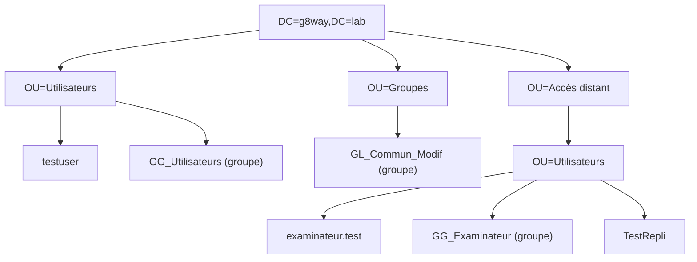
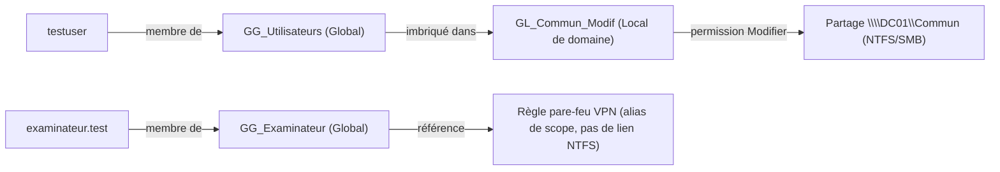

# Structure Active Directory — Projet G8Way

## Domaine

| Élément | Valeur |
|---|---|
| Forêt / domaine | g8way.lab (NetBIOS : G8WAY) |
| DC01 | Premier contrôleur, 10.10.10.10 — forêt promue via `Install-ADDSForest` |
| DC02 | Second contrôleur (réplica AD) — réplication vérifiée via `repadmin /replsummary` |

## Arborescence des unités d'organisation

Cette structure reflète une évolution en deux temps : l'OU de base (utilisateurs internes, partage de
fichiers) a été complétée ensuite par une branche dédiée à l'accès distant examinateur — une extension
itérative plutôt qu'une conception figée dès le départ.

## Modèle AGDLP — flux et imbrication

Deux flux distincts coexistent : un flux **partage de fichiers** (AGDLP classique avec permissions
NTFS) et un flux **accès VPN examinateur** (groupe utilisé uniquement comme référence pour les règles
pare-feu, sans permission NTFS associée).

## Groupes — détail

| Groupe | Portée | Rôle | Membres |
|---|---|---|---|
| `GG_Utilisateurs` | Global | Regroupe les comptes utilisateurs standards | `testuser` |
| `GL_Commun_Modif` | Local de domaine | Porte les permissions NTFS/SMB sur le partage `\\DC01\Commun` (Modifier) | `GG_Utilisateurs` (imbriqué) |
| `GG_Examinateur` | Global | Référence pour les règles pare-feu VPN (alias de scope, sans lien NTFS) | `examinateur.test` |

## Comptes utilisateurs

| Compte | Rôle |
|---|---|
| `testuser` | Compte de test initial du lab de base |
| `TestRepli` | Compte de test négatif — ne doit **pas** être membre de `GL_Commun_Modif` (ni via `GG_Utilisateurs`) ; sert à prouver qu'un accès non autorisé est bien refusé (`net use` → erreur système 5 attendue) |
| `examinateur.test` | Compte examinateur distant, membre de `GG_Examinateur` |
| `administrateur` | Compte d'administration du domaine, utilisé pour les connexions SSH/RDP d'administration |

## GPO appliquées

| GPO | Liaison | Effet |
|---|---|---|
| `GPO-Restriction-Utilisateurs` | OU=Utilisateurs | Fond d'écran imposé, restriction du panneau de configuration |
| GPO RDP | Default Domain Controllers Policy (ou GPO dédiée) | Active le Bureau à distance sur les contrôleurs de domaine, vérifiée via `gpresult /r` |

## Vérifications de cohérence

- Réplication AD entre DC01 et DC02 : `repadmin /replsummary`
- Application des GPO : `gpresult /r`
- Contrôle des comptes et de leur appartenance aux groupes : `Get-ADUser`

Voir aussi : [Diagnostic & résolution de pannes](troubleshooting.md) (incidents #1 et #2, liés à cette
structure AD) et [Limitations documentées](limitations.md) (point 5, écart de nommage sur le compte
examinateur).
